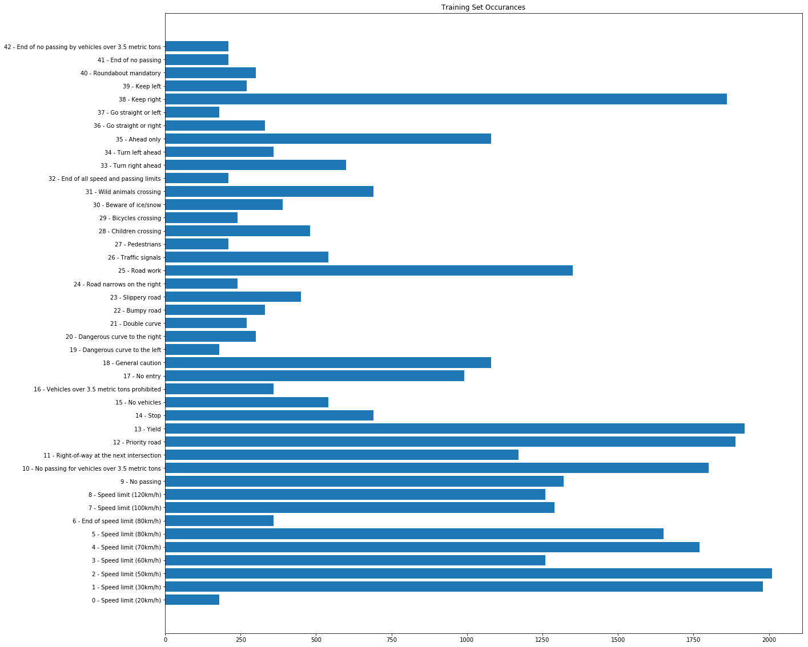
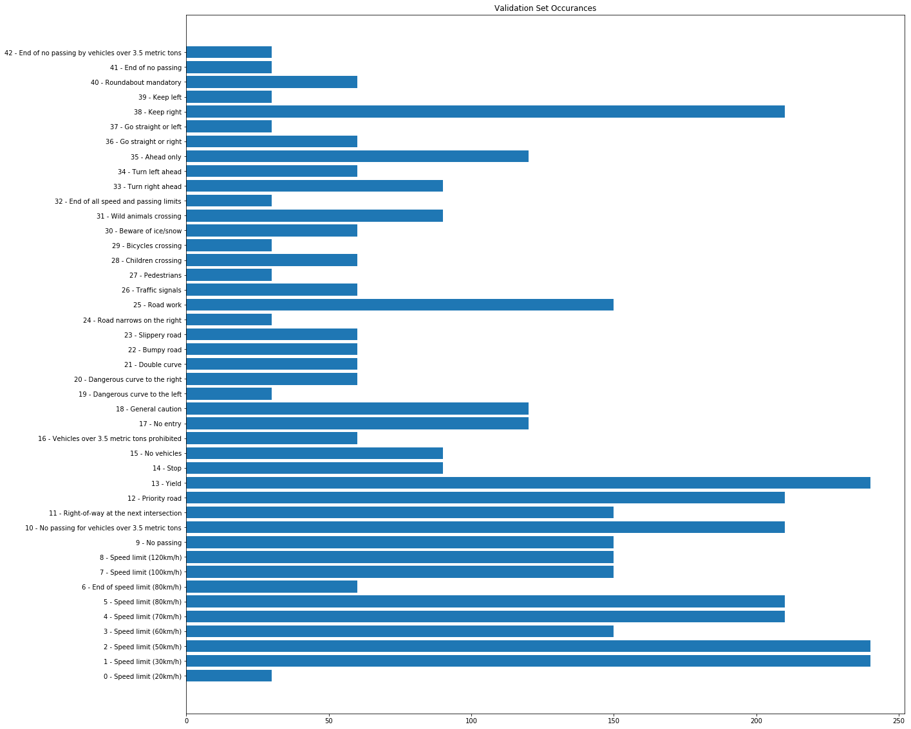
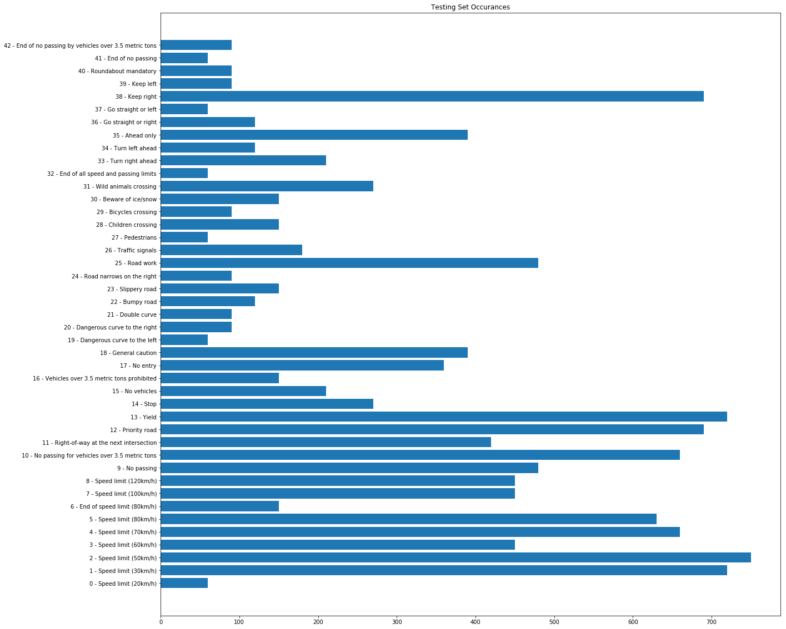
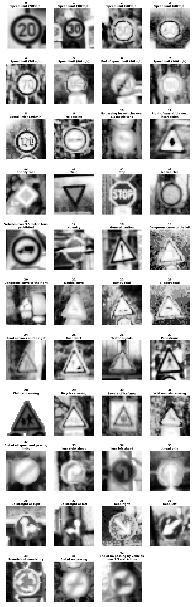
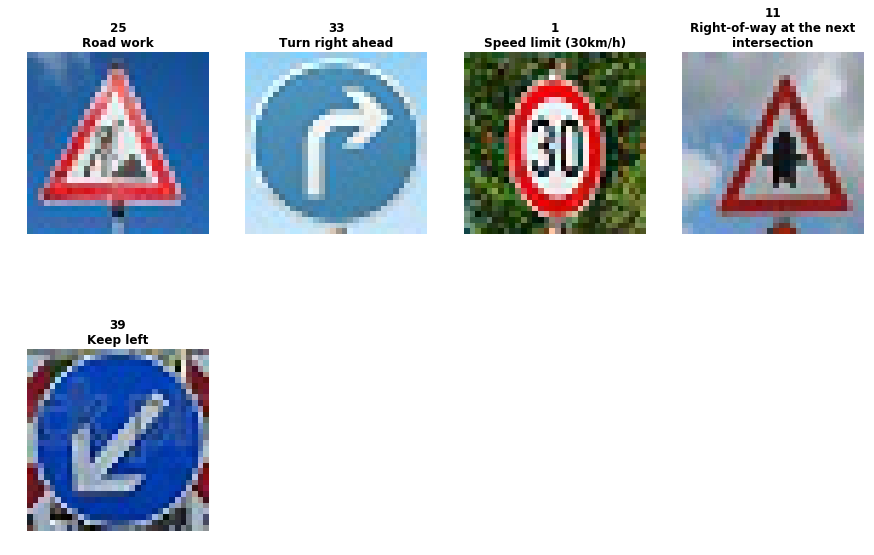
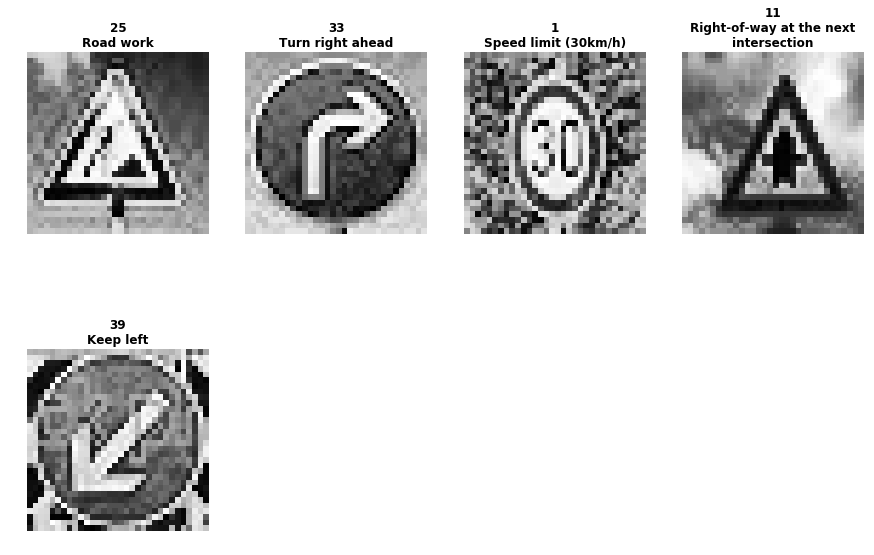
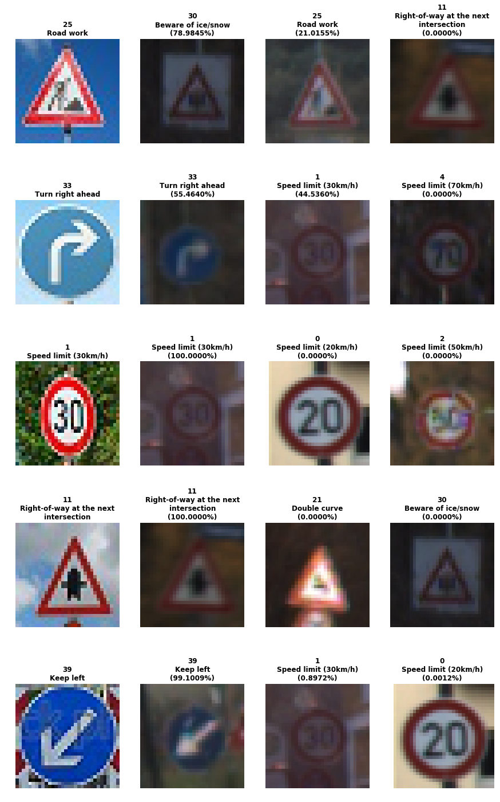

# **Traffic Sign Recognition** 

---

**Build a Traffic Sign Recognition Project**

The goals / steps of this project are the following:
* Load the data set (see below for links to the project data set)
* Explore, summarize and visualize the data set
* Design, train and test a model architecture
* Use the model to make predictions on new images
* Analyze the softmax probabilities of the new images
* Summarize the results with a written report

### Data Set Summary & Exploration

#### 1. Data Set Summary

I used the pandas library to calculate summary statistics of the traffic
signs data set:

* The size of training set is 34,799
* The size of the validation set is 4,410
* The size of test set is 12,630
* The shape of a traffic sign image is 32 x 32 x 3
* The number of unique classes/labels in the data set is 43

#### 2. Data Set Visualization

Here is an exploratory visualization of the training, validation, and test data sets.

The first set of images are labeled examples from the training set.

The next set of images are bar charts showing the number of samples by type from the training, validation, and test data sets.

The next set of images are bar charts showing the number of samples by type from the training, validation, and test data sets.

### Design and Test a Model Architecture

#### 1. Data Preprocessing

As a first step, I decided to convert the images to grayscale because color is not critical in sign classification, and removing color reduces unnecessary information when training the network.  This will increase the network training and prediction efficiency.    I also ran cv2.equalizeHist to improve the image contrast.

As a last step, I normalized the image data to scale down the pixel values to a range between -1 and 1.   This should help increase the network's learning efficiency.

A sample of each image class after preprocessing is shown below.

#### 2. Convolutional Neural Network Model

My final model consisted of the following layers:

|      Layer      |               Description                |
| :-------------: | :--------------------------------------: |
|      Input      |         32x32x1 grayscale image          |
| Convolution 5x5 | 1x1 stride, same padding, outputs 28x28x6 |
|      RELU       |                                          |
|   Max pooling   |       2x2 stride,  outputs 14x14x6       |
| Convolution 5x5 | 1x1 stride, same padding, outputs 10x10x16 |
|      RELU       |                                          |
|   Max pooling   |       2x2 stride,  outputs 5x5x16        |
|     Flatten     |                Output 120                |
|      RELU       |                                          |
| Fully Connected |                Output 84                 |
|      RELU       |                                          |
| Fully Connected |            Output 43 classes             |

#### 3. Training optimizer and Hyperparameters

To train the model, I used an Adam optimizer.  I an 75 epochs with a batch size of 300.  The learning rate used was 0.002.

#### 4. Solution Approach and Model Selection

My final model results were:
* training set accuracy of 99.922%
* validation set accuracy of 94.558%
* test set accuracy of 92.423%

I chose the LeNet model based on previous experience using it with MINST data.  LeNet was effective classifying images from the MISNT dataset.  I believed it would likely be effective classifying road sign images.

The model performed reasonably well.  The validation and test accuracy rates were over 92%.

### Testing Model on New Images

#### 1. Five Test Road Signs

Here are five German traffic signs that I found on the web.  The third image might be difficult to classify because the sign is at an angle in the photo.  The last image may also be difficult as it has a watermark overlay.

The images after preprocessing are shown below.

#### 2. Test Results

Here are the results of the prediction:

|                  Image                   |                Prediction                |
| :--------------------------------------: | :--------------------------------------: |
|              25 - Road work              |      ***30 - Beware of ice/snow***       |
|          33 - Turn right ahead           |          33 - Turn right ahead           |
|         1 - Speed Limit (30km/h)         |         1 - Speed Limit (30km/h)         |
| 11 - Right-of-way at the next intersection | 11 - Right-of-way at the next intersection |
|              39 - Keep Left              |              39 - Keep Left              |

The model was able to correctly guess 4 of the 5 traffic signs, which gives an accuracy of 80%. This is lower than the test set accuracy - 92.4% 

#### 3. Test Prediction Certainty

The code for making predictions on my final model is located in the 18th cell of the Ipython notebook.

The prediction results along with Softmax certainty values are sown in the image below.   The code that produced the image is located in the 20th cell of the IPython notebook.

